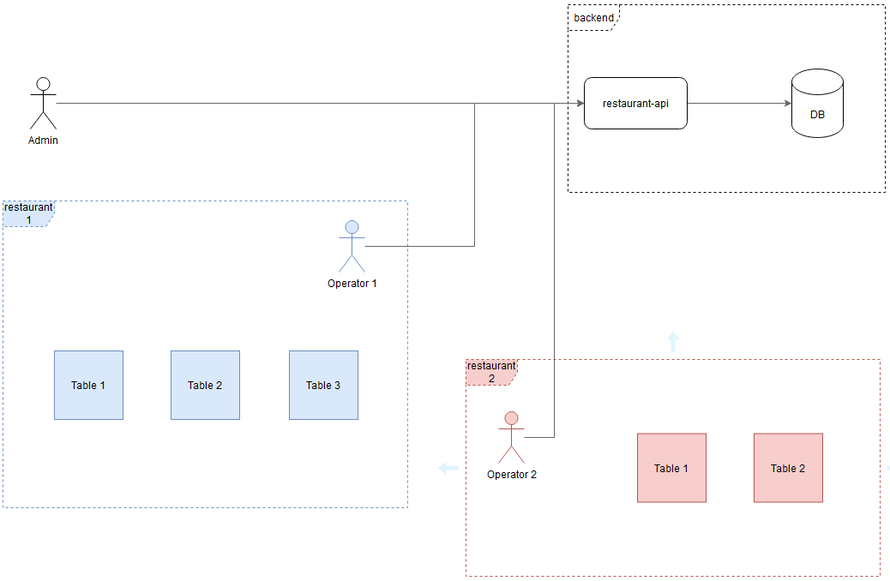

# Challenge 3 - Restaurant

## Intro

Esta actividad consiste en desarrollar un sistema para la administración de restaurants.

El challenge deberá ser llevado a cabo en equipos en su correspondiente repositorio GIT: [repos](https://gitlab.com/flexia-escuelita/challenges)

La idea del sistema es poder registrar diferentes restaurants con sus respectivas mesas y productos. Además, el sistema debe permitir hacer el seguimiento de los pedidos que se hagan a una mesa para poder calcular finalmente el total a pagar para cancelar la misma.

Representación del sistema:

## Requerimientos obligatorios:

Se deberán implementar los siguientes requerimientos funcionales mínimos:

- El sistema debe tener un rol de usuario administrador, el cual deberá poder registrar nuevos restaurants en el sistema.

- El sistema debe permitir la creación de uno o más operadores asociados a un restaurant. Un operador deberá poder administrar sólo el restaurant para el que fue creado.

- Un operador debe poder crear, modificar o eliminar mesas para un restaurant en particular.

- El sistema debe permitir dar de alta diferentes productos asociando un precio a los mismos.

- Un operador debe poder iniciar una orden, asociarla a una mesa y agregar productos a la misma (Una mesa no puede tener más de una orden activa en un determinado momento).

- Un operador debe poder finalizar una orden, acción que resultará en la liberación de la mesa para nuevas órdenes y en la generación de un resumen de la orden donde se podrá visualizar la lista de productos asociados con su precio y el total calculado para la misma.

## Requerimientos opcionales:

- El sistema debe soportar la posibilidad de indicar que una orden es para delivery. Estas órdenes no estarán asociadas a ninguna mesa en particular pero sí deberán poder asociarse a una dirección y número de teléfono en particular.

- El sistema debe permitir especificar un precio distinto al cargado en el sistema al momento de asociar un producto a una orden en curso.

- El sistema debe permitir incorporar un porcentaje de descuento a una orden en particular antes de finalizarla.

## Lineamientos a respetar:

El servicio debe consistir de una API REST utilizando lo siguiente:
- Spring Boot
- Spring Web (REST Controllers)
- Spring Security
- Spring Data JPA (+H2)
- JWT para autenticación
- Documentación de interfaz con Swagger / OpenAPI
- Configuración de ambientes "local" y "development" en base a archivos application.properties